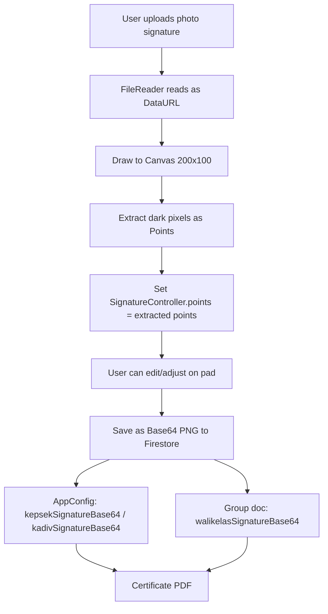

# Fitur Upload Foto Tanda Tangan & Konversi ke Vektor

## Ringkasan

Menambahkan fitur upload foto tanda tangan untuk 3 peran (Kepala Sekolah, Wali Kelas, Kepala Divisi MAI) yang otomatis dikonversi ke representasi vektor (titik koordinat). Fitur ini memanfaatkan kode `_uploadAndConvertSignature()` yang sudah ada di [`setup_screen.dart`](../lib/features/auth/setup_screen.dart:1131) dan memperluasnya ke seluruh aplikasi.

---

## 1. Buat Shared Widget: `SignatureUploadWidget`

**File:** [`lib/features/shared/signature_upload_widget.dart`](../lib/features/shared/signature_upload_widget.dart) (baru)

Tujuan: Widget reusable yang menggabungkan signature pad + tombol upload foto + konversi ke vektor.

### Komponen:
- **Signature Pad** — menggunakan [`Signature`](https://pub.dev/packages/signature) controller (sama seperti yang sudah ada)
- **Tombol "Unggah Foto (Vektor)"** — memicu `html.FileUploadInputElement`, membaca file gambar, menggambar ke canvas, mengekstrak piksel gelap sebagai titik koordinat (`Point`), lalu mengisi `SignatureController` dengan titik-titik tersebut
- **Tombol "Hapus Tanda Tangan"** — membersihkan pad
- **Callback `onSignatureChanged`** — opsional, untuk memberi tahu parent jika ada perubahan

### Logika Konversi Foto ke Vektor (existing, perlu diekstrak):
1. Buka file dialog (`html.FileUploadInputElement`)
2. Baca file sebagai Data URL (`FileReader.readAsDataUrl`)
3. Gambar ke `CanvasElement` ukuran 200x100
4. Iterasi piksel (step 3 untuk performa), hitung luminance
5. Jika luminance < 120, anggap sebagai bagian dari tanda tangan
6. Buat objek `Point(Offset(x, y), PointType.tap, 1.0)` dan masukkan ke controller

### Parameter:
```dart
class SignatureUploadWidget extends StatelessWidget {
  final SignatureController controller;
  final String title;
  final double height; // default 120
  final void Function()? onCleared;
}
```

---

## 2. Update Model: [`AppConfig`](../lib/features/shared/models.dart:208)

**Tujuan:** Menambahkan field untuk signature vektor Wali Kelas dan memastikan Kadiv signature sudah didukung.

### Perubahan:
- Field `kadivSignatureBase64` sudah ada — OK
- Field `kadivNama` — **TAMBAH** untuk menyimpan nama Kepala Divisi MAI
- Field `walikelasSignatureBase64` — **TAMBAH** (optional, per wali kelas akan disimpan di dokumen group)

### Update `AppConfig`:
```dart
class AppConfig {
  // ... existing fields
  final String? kadivNama; // NAMA BARU
  final String? kadivSignatureBase64; // SUDAH ADA
  // NOTE: Walikelas signatures disimpan per-group, bukan di global config
}
```

### Update `Group` model:
```dart
class Group {
  // ... existing fields
  final String? walikelasSignatureBase64; // BARU: untuk menyimpan tanda tangan wali kelas
}
```

---

## 3. Update [`FirebaseService`](../lib/features/shared/firebase_service.dart)

**Tujuan:** Menambahkan method untuk update signature wali kelas di dokumen group.

### Method baru:
```dart
Future<void> updateWalikelasSignature(String walikelasName, String signatureBase64) async {
  await _firestore.collection('groups').doc(walikelasName).update({
    'walikelasSignatureBase64': signatureBase64,
  });
}
```

---

## 4. Update [`SetupScreen`](../lib/features/auth/setup_screen.dart)

**Tujuan:** Menambahkan input untuk Kepala Divisi MAI (nama + upload foto signature) di Step 1.

### Perubahan di Step 1 (`_buildStep1KepsekVerification`):
- Tambah field input: **Nama Kepala Divisi MAI**
- Tambah **SignatureUploadWidget** untuk Kadiv (dengan opsi upload foto)
- Simpan `kadivNama` dan `kadivSignatureBase64` ke `AppConfig`

### Perubahan di `_verifyNewKepsek()`:
- Setelah menyimpan config, tambahkan `kadivNama` dan `kadivSignatureBase64`

### Perubahan di `_submitSetup()`:
- Sertakan `kadivNama` dan `kadivSignatureBase64` saat menyimpan config

---

## 5. Update Dashboard Tab 5: [`LiveDashboard._buildManageProfileAndGroupsTab`](../lib/features/dashboard/live_dashboard.dart:975)

**Tujuan:** Menambahkan UI untuk mengelola upload foto signature Kepala Divisi MAI dan Wali Kelas.

### A. Bagian Profil Kepala Sekolah (existing):
- Tambahkan **SignatureUploadWidget** untuk Kadiv di bawah profil Kepsek
- Field input untuk nama Kadiv
- Tombol simpan

### B. Bagian Kelompok Wali Kelas (existing):
- Di setiap kartu grup, tambahkan **SignatureUploadWidget** untuk Wali Kelas
- Simpan signature ke Firestore via `updateWalikelasSignature()`

---

## 6. Update [`QudwahForm`](../lib/features/qudwah/qudwah_form.dart)

**Tujuan:** Menambahkan opsi upload foto untuk tanda tangan Wali Kelas.

### Perubahan:
- Ganti signature pad biasa dengan **SignatureUploadWidget**
- Tambahkan tombol "Unggah Foto Tanda Tangan" yang mengkonversi ke vektor
- Simpan signature ke group document juga (tidak hanya di evaluation)

---

## 7. Update PDF Certificate & Rekap

### A. Sertifikat ([`_generateCertificatePDF`](../lib/features/dashboard/live_dashboard.dart:916)):
- Tambahkan placeholder/tempat untuk **3 tanda tangan**: Kepsek, Wali Kelas, Kadiv
- Jika signature base64 tersedia, render gambar di PDF
- Jika tidak, tampilkan placeholder garis + nama

### B. Rekap PDF ([`_downloadRekapPDF`](../lib/features/dashboard/live_dashboard.dart:108)):
- Tambahkan kolom tanda tangan untuk Kepsek dan Kadiv di bagian bawah

---

## Alur Data Flow



---

## File yang Diubah

| File | Perubahan |
|------|-----------|
| `lib/features/shared/signature_upload_widget.dart` | **BARU** - Widget reusable upload + konversi |
| `lib/features/shared/models.dart` | Tambah field `kadivNama` di AppConfig, `walikelasSignatureBase64` di Group |
| `lib/features/shared/firebase_service.dart` | Tambah method `updateWalikelasSignature()` |
| `lib/features/auth/setup_screen.dart` | Tambah input Kadiv di Step 1, gunakan SignatureUploadWidget |
| `lib/features/dashboard/live_dashboard.dart` | Tambah Kadiv signature management di Tab 5, tambah walikelas signature upload di kartu grup, update PDF |
| `lib/features/qudwah/qudwah_form.dart` | Ganti signature pad dengan SignatureUploadWidget |

---

## Prioritas & Urutan Implementasi

1. **Buat `SignatureUploadWidget`** — fondasi untuk semua fitur upload
2. **Update `models.dart`** — tambah field yang diperlukan
3. **Update `firebase_service.dart`** — tambah method penyimpanan
4. **Update `setup_screen.dart`** — tambah Kadiv di setup awal
5. **Update `live_dashboard.dart`** — tambah manajemen signature di dashboard
6. **Update `qudwah_form.dart`** — tambah upload untuk wali kelas
7. **Update PDF generation** — tampilkan semua signature di sertifikat & rekap
